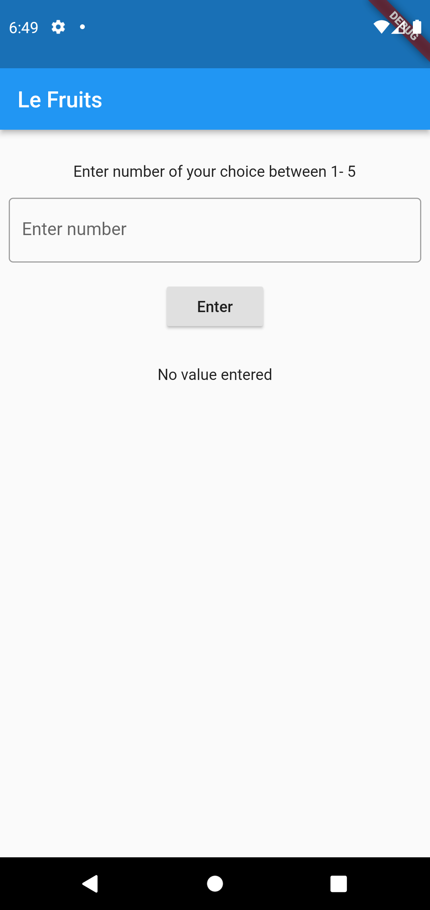
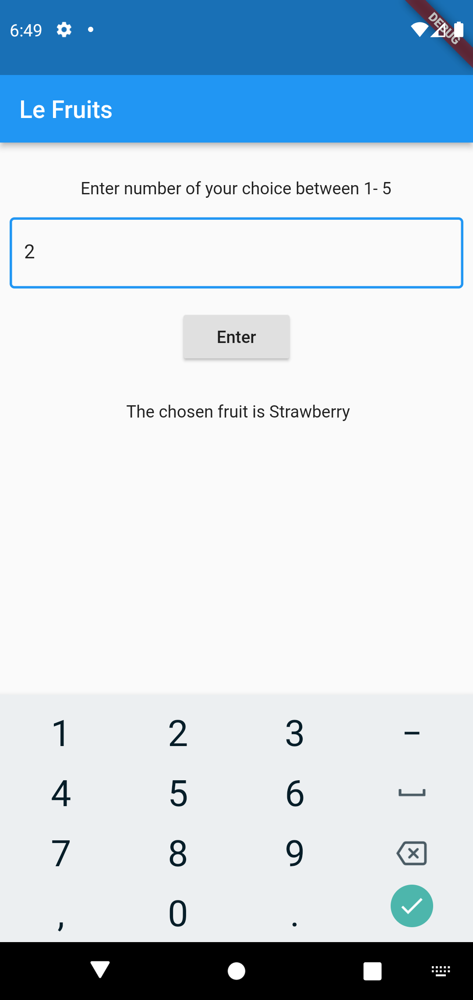
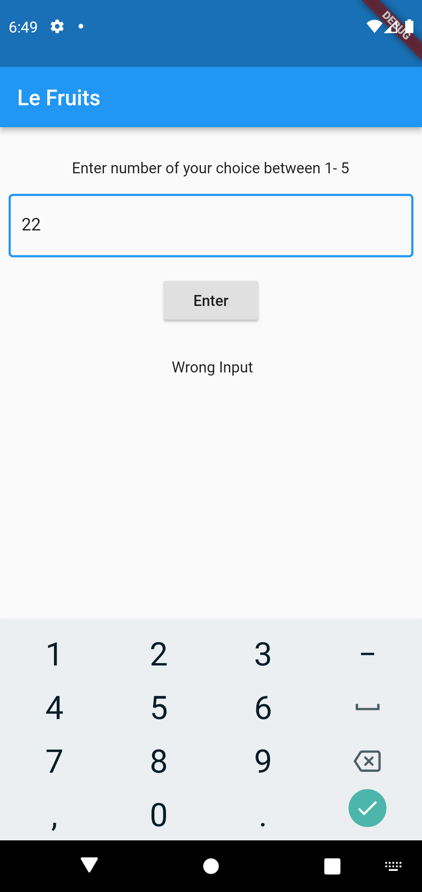

# assessment
new to git 

# project description
this is a simple app named 'Le Fruits' built for my Assignment 1 of Mobile App Development course regarding how to use lists in flutter.

# how to run
flutter run

# images of app

 

